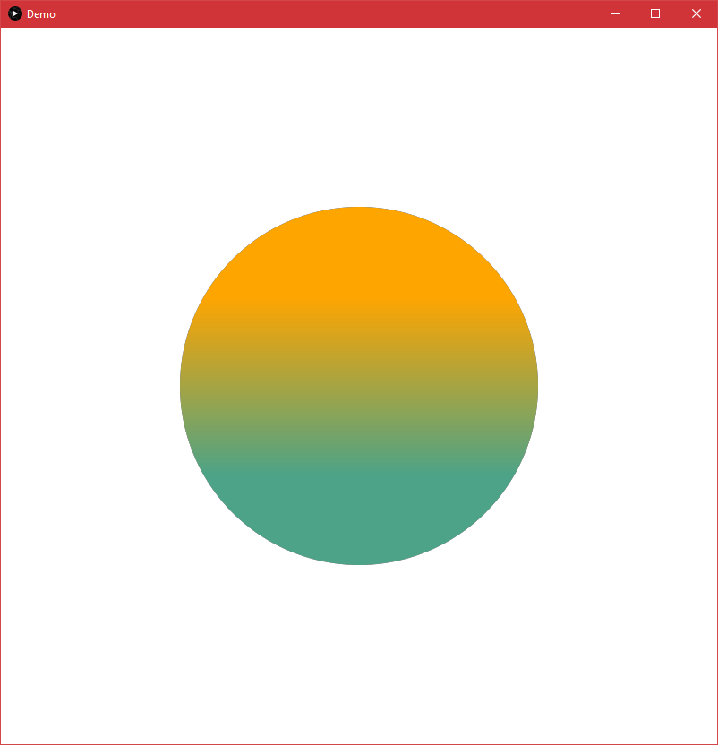
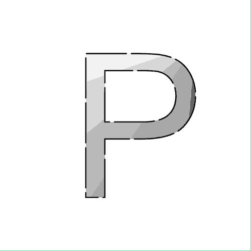
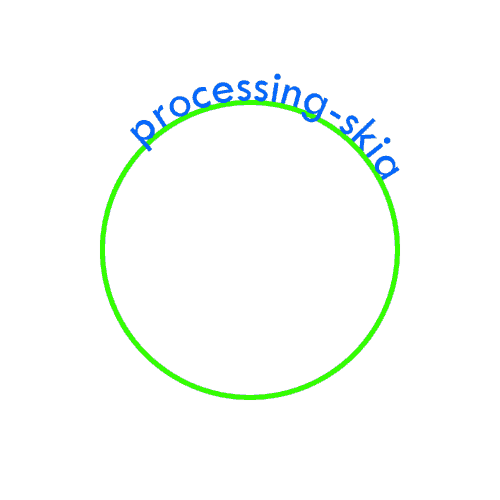

# processing-skia

**Skia** is an open source 2D graphics library which provides common APIs that work across a variety of hardware and software platforms.

**Skija** provides high-quality Java bindings for Skia.

**processing-skia** does the backend work of setting Skija's render target to Processing, so you can easily use any Skija [bindings](https://github.com/JetBrains/skija/blob/master/docs/Getting%20Started.md) to draw into a Processing sketch.

## Requirements
* Java 11+ (Processing 4)
* A Processing sketch using either the `P2D` or `P3D` renderer.

## Download
Download a .jar of *processing-skia* from [releases](https://github.com/micycle1/processing-skia/releases/).

## Example
### Code

```
import micycle.processingSkia.SkiaCanvas;
import org.jetbrains.skija.*;

Canvas skiaCanvas;

@Override
public void settings() {
    size(800, 800, P2D);
}

@Override
public void setup() {
    skiaCanvas = SkiaCanvas.getSkiaCanvas(this);
}

@Override
public void draw() {
    background(255);
	
    Paint fill = new Paint().setShader(Shader.makeLinearGradient(400, 300, 400, 500, new int[] {0xFFFFA500, 0xFF4CA387}));
	
    skiaCanvas.drawCircle(400, 400, 200, fill);
}
```
### Result
<p align="center">
</a><br></p>

## More examples

A number of example Processing sketches are provided in [examples](https://github.com/micycle1/processing-skia/tree/main/examples).

<table>
  <tr>
    <td align="center" valign="center"><b>Dash Stroke</td>
    <td align="center" valign="center"><b>Text on Path</td>
    <td align="center" valign="center"><b></td>
  </tr>
  <tr>
    <td valign="top" width = 33%></td>
    <td valign="top" width = 33%></td>
    <td valign="top" width = 33%></td>
  </tr>
</table>

## Further Work
Further work would wrap the Skija library itself, creating Processing-like bindings around Skija's API (a `PGraphicsSkia`) leading to the possibility of a dedicated Skia-based renderer in Processing.